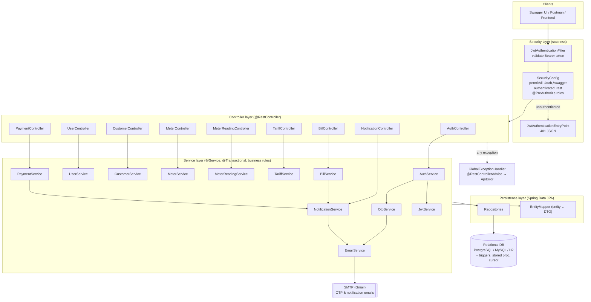
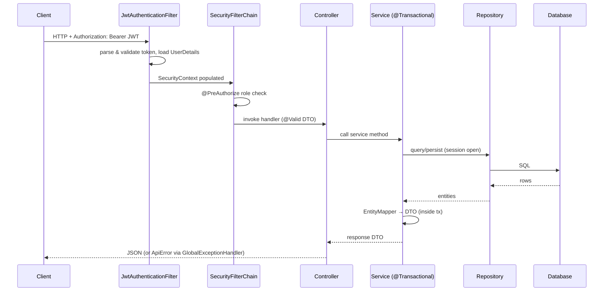
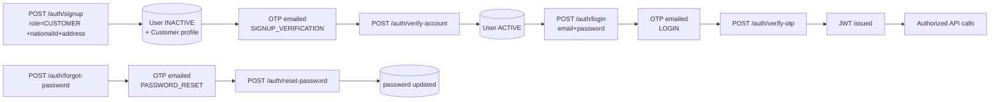

# System Architecture — Utility Billing System

A layered Spring Boot 3 / Java 21 backend with stateless JWT security, OTP-based
auth (email delivery), versioned billing configuration, and DB-side routines.
Diagrams below are in Mermaid (render with the IntelliJ **Mermaid** plugin or at
<https://mermaid.live>) plus a plain-text fallback.

---

## A. High-level component architecture



---

## B. Request lifecycle (one secured call)



---

## C. Two-step OTP authentication flow



---

## D. Plain-text layered view (fallback)

```
            ┌───────────────────────────────────────────────────────┐
 Clients →  │  Swagger UI · Postman · Frontend (HTTP + Bearer JWT)   │
            └───────────────────────────┬───────────────────────────┘
                                        │
        ┌───────────────────────────────▼─────────────────────────────┐
 SEC    │ JwtAuthenticationFilter → SecurityFilterChain (stateless)    │
        │ permitAll(/auth,/swagger,/h2) · authenticated(rest)          │
        │ @EnableMethodSecurity + @PreAuthorize(role)                  │
        │ unauthenticated → JwtAuthenticationEntryPoint (401 JSON)     │
        └───────────────────────────────┬─────────────────────────────┘
                                        │
 WEB    │ Auth · User · Customer · Meter · Reading · Tariff · Bill ·   │
        │ Payment · Notification controllers  (@Valid request DTOs)    │
        └───────────────────────────────┬─────────────────────────────┘
                                        │   (any exception)
 SVC    │ *Service + *ServiceImpl  (@Transactional, business rules)    │──► GlobalExceptionHandler
        │ Auth/Otp/Email/Jwt · Customer · Meter · Reading · Tariff ·   │     (@RestControllerAdvice
        │ Bill · Payment · Notification        EntityMapper(entity→DTO)│      → ApiError JSON)
        └───────┬───────────────────────────────────┬─────────────────┘
                │                                   │
 DATA   │ Spring Data JPA Repositories │     │ EmailService → SMTP (Gmail)  │
        └───────┬──────────────────────┘     └──────────────────────────────┘
                │
        ┌───────▼───────────────────────────────────────────────────┐
 DB     │ PostgreSQL / MySQL / H2                                     │
        │ tables + TRIGGER (notify on bill insert / paid)            │
        │        + STORED PROCEDURE + CURSOR (overdue penalties)     │
        └────────────────────────────────────────────────────────────┘
```

---

## E. Package map

```
com.utility.billing
├── config        SecurityConfig, OpenApiConfig, DataInitializer
├── security      JwtService, JwtAuthenticationFilter, JwtAuthenticationEntryPoint,
│                 CustomUserDetailsService
├── controller    9 @RestControllers
├── service       interfaces  +  impl/  (business logic, @Transactional)
├── repository    Spring Data JPA interfaces
├── entity        JPA entities  +  enums/
├── dto           request/  response/   (Java records, Bean Validation)
├── mapper        EntityMapper
└── exception     GlobalExceptionHandler, ApiError, custom exceptions
```

**Cross-cutting concerns**
- **Security:** stateless JWT (HS256), BCrypt, role-based `@PreAuthorize`, OTP 2FA.
- **Validation:** Bean Validation on every DTO + business-rule checks in services.
- **Auditing:** `BaseEntity` with `@CreatedDate`/`@LastModifiedDate` (JPA Auditing).
- **Email:** `EmailService` SMTP abstraction for OTP + bill/payment notifications.
- **Error handling:** one `@RestControllerAdvice` → consistent `ApiError` envelope.
- **DB routines:** trigger + stored procedure + cursor (see `src/main/resources/db`).
```
