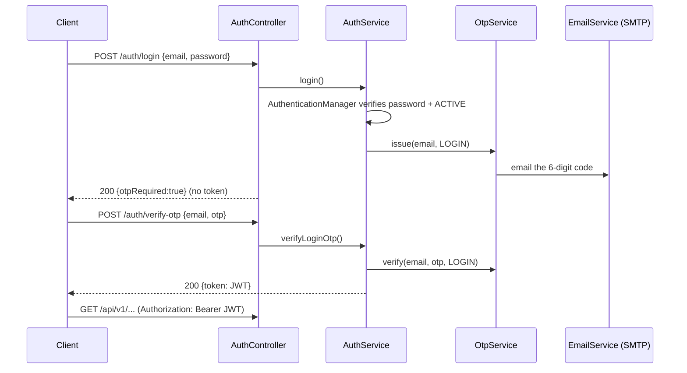

# Utility Billing System — System Design & Documentation

Backend for a national utility company managing **water** (postpaid) and
**electricity** (transitioning prepaid → postpaid). Built with Java 21, Spring
Boot 3, Spring Data JPA, Spring Security 6 + JWT, Bean Validation and
Swagger/OpenAPI.

---

## 1. Entity Relationship Diagram (explanation)

```
USER (system account)            CUSTOMER (account holder)
  id (PK)                          id (PK)
  full_names                       full_names
  email (UQ, username)             national_id (UQ)
  phone_number                     email (UQ)
  password (bcrypt)                phone_number
  role  (enum)                     address
  status(enum)                     status (enum)
  customer_id (FK, nullable) ───►  │
                                   │ 1..*
                                   ▼
                                 METER
                                   id (PK)
                                   meter_number (UQ)
                                   meter_type (WATER|ELECTRICITY)
                                   installation_date
                                   status (ACTIVE|INACTIVE)
                                   customer_id (FK) ──► CUSTOMER
                                   │ 1..*
                                   ▼
                              METER_READING
                                   id (PK)
                                   meter_id (FK)
                                   previous_reading, current_reading, consumption
                                   reading_date, month, year   (UQ: meter+month+year)
                                   billed

TARIFF (versioned)            TARIFF_TIER          TAX (versioned)     PENALTY (versioned)
  id (PK)                       id (PK)              id (PK)             id (PK)
  meter_type                    tariff_id (FK)       name, percentage    name, percentage
  tariff_type (FLAT|TIERED)     up_to_unit           version             version
  version                       rate_per_unit        effective_start/end effective_start/end
  rate_per_unit, service_charge
  effective_start / effective_end

BILL                                   PAYMENT
  id (PK)                                id (PK)
  bill_reference (UQ)                    bill_id (FK) ──► BILL
  customer_id (FK) ──► CUSTOMER          amount_paid
  meter_id (FK) ──► METER                payment_method (enum)
  month, year   (UQ: meter+month+year)   payment_date
  consumption, tariff_amount,            transaction_reference
  service_charge, tax_amount,
  penalty_amount, total_amount,        NOTIFICATION
  amount_paid, outstanding_balance       id (PK)
  due_date, status (enum)                customer_id (FK) ──► CUSTOMER
                                         bill_id (FK, nullable) ──► BILL
                                         message
                                         status (PENDING|SENT|FAILED)
                                         created_at
```

### Relationships
- **Customer 1 — N Meter**: a customer owns one or more meters.
- **Meter 1 — N MeterReading**: a meter accumulates monthly readings (unique per month/year).
- **Tariff 1 — N TariffTier**: a tiered tariff has ordered blocks; flat tariffs have none.
- **Customer 1 — N Bill** and **Meter 1 — N Bill**: a bill belongs to one customer/meter for one month/year (unique).
- **Bill 1 — N Payment**: a bill is settled by one or more payments (partial/full).
- **Customer 1 — N Notification** and **Bill 1 — N Notification**.
- **User 0..1 — 1 Customer**: a `ROLE_CUSTOMER` login optionally links to a customer profile.

---

## 2. Database Tables and Relationships

| Table | Purpose | Key constraints |
|-------|---------|-----------------|
| `users` | system accounts/logins | UQ `email` |
| `customers` | account holders | UQ `national_id`, UQ `email` |
| `meters` | physical meters | UQ `meter_number`, FK `customer_id` |
| `meter_readings` | monthly readings | UQ (`meter_id`,`month`,`year`), FK `meter_id` |
| `tariffs` | versioned pricing | FK tiers |
| `tariff_tiers` | tiered blocks | FK `tariff_id` |
| `taxes` | versioned VAT/tax | — |
| `penalties` | versioned late penalty | — |
| `bills` | monthly bills | UQ `bill_reference`, UQ (`meter_id`,`month`,`year`) |
| `payments` | payments vs bills | FK `bill_id` |
| `notifications` | customer messages | FK `customer_id`, FK `bill_id` |

---

## 3. Spring Boot Flow (explanation)

```
HTTP Request
   │
   ▼
[ JwtAuthenticationFilter ]  → extracts & validates Bearer token, sets SecurityContext
   │
   ▼
[ SecurityFilterChain ]      → permitAll on /auth, /swagger; authenticated elsewhere
   │
   ▼
[ Controller ]               → @PreAuthorize role checks, @Valid request DTO
   │
   ▼
[ Service (interface+impl) ] → business rules, @Transactional
   │
   ▼
[ Repository (Spring Data) ] → JPA/Hibernate → Database
   │
   ▼
[ EntityMapper ]             → entity → response DTO
   │
   ▼
HTTP Response (JSON)         ← GlobalExceptionHandler wraps any error as ApiError
```

---

## 4. Package Structure

```
com.utility.billing
├── UtilityBillingApplication
├── config            SecurityConfig, OpenApiConfig, DataInitializer
├── security          JwtService, JwtAuthenticationFilter,
│                     JwtAuthenticationEntryPoint, CustomUserDetailsService
├── entity            User, Customer, Meter, MeterReading, Tariff, TariffTier,
│   └── enums         Tax, Penalty, Bill, Payment, Notification, BaseEntity
├── dto
│   ├── request       *Request records (Bean Validation)
│   └── response      *Response records
├── mapper            EntityMapper (entity → DTO)
├── repository        Spring Data JPA interfaces
├── service           service interfaces
│   └── impl          service implementations (business logic)
├── controller        REST controllers (Swagger annotated)
└── exception         GlobalExceptionHandler, custom exceptions, ApiError
```

---

## 5. Security Flow (with OTP)

Authentication is **OTP-backed end to end**, delivered by **email (SMTP)**. OTP codes
are 6 digits, expire in 10 minutes (configurable), are single-use, and are also logged
to the console when `app.otp.log-to-console=true` so the system can be demoed without SMTP.

**Signup + account verification**
1. `POST /auth/signup` — password BCrypt-hashed; account saved **INACTIVE**; a
   `SIGNUP_VERIFICATION` OTP is emailed.
2. `POST /auth/verify-account` `{email, otp}` — validates the OTP and flips the account to
   **ACTIVE**. Until then the account cannot log in (rule: *inactive users cannot authenticate*).

**Two-step login**
3. `POST /auth/login` `{email, password}` — `AuthenticationManager` → `DaoAuthenticationProvider`
   verifies the password **and** that the account is enabled (ACTIVE). On success a `LOGIN`
   OTP is emailed; **no token is returned yet**.
4. `POST /auth/verify-otp` `{email, otp}` — validates the OTP and returns a signed
   **JWT (HS256)** embedding the email (subject) and role claim.

**Password reset**
5. `POST /auth/forgot-password` `{email}` — emails a `PASSWORD_RESET` OTP.
6. `POST /auth/reset-password` `{email, otp, newPassword}` — validates the OTP and stores the
   new BCrypt hash.

**On every secured request**
7. The client sends `Authorization: Bearer <token>`; `JwtAuthenticationFilter` validates it
   and loads the user into the `SecurityContext`.
8. `SecurityConfig` is **stateless** (no session). All routes require authentication
   except `/auth/**`, `/swagger-ui/**`, `/v3/api-docs/**`, `/h2-console/**`.
9. `@EnableMethodSecurity` + `@PreAuthorize("hasRole('…')")` enforce role-based access per endpoint.



---

## 6. API Endpoint List

| Method | Path | Description | Roles |
|--------|------|-------------|-------|
| POST | `/api/v1/auth/signup` | register account (INACTIVE) + email OTP | public |
| POST | `/api/v1/auth/verify-account` | activate account with signup OTP | public |
| POST | `/api/v1/auth/login` | login step 1: verify password, email OTP | public |
| POST | `/api/v1/auth/verify-otp` | login step 2: verify OTP → JWT | public |
| POST | `/api/v1/auth/forgot-password` | email a password-reset OTP | public |
| POST | `/api/v1/auth/reset-password` | set new password with OTP | public |
| GET | `/api/v1/users` | list users | ADMIN |
| GET | `/api/v1/users/{id}` | get user | ADMIN |
| PATCH | `/api/v1/users/{id}/status` | activate/deactivate | ADMIN |
| POST | `/api/v1/customers` | register customer | ADMIN |
| PUT | `/api/v1/customers/{id}` | update customer | ADMIN |
| GET | `/api/v1/customers` `/{id}` | list/get customer | ADMIN, FINANCE, OPERATOR |
| PATCH | `/api/v1/customers/{id}/status` | activate/deactivate customer (no hard delete — preserves audit) | ADMIN |
| POST | `/api/v1/meters` | register meter | ADMIN |
| PUT | `/api/v1/meters/{id}` | update meter | ADMIN |
| GET | `/api/v1/meters` `/{id}` `/customer/{id}` | list/get meters | ADMIN, FINANCE, OPERATOR |
| POST | `/api/v1/readings` | capture reading | OPERATOR, ADMIN |
| GET | `/api/v1/readings` `/{id}` `/meter/{id}` | list/get readings | OPERATOR, ADMIN, FINANCE |
| POST | `/api/v1/config/tariffs` | create tariff version | ADMIN |
| GET | `/api/v1/config/tariffs` `/{id}` | list/get tariffs | ADMIN, FINANCE |
| POST | `/api/v1/config/taxes` | create tax version | ADMIN |
| GET | `/api/v1/config/taxes` | list taxes | ADMIN, FINANCE |
| POST | `/api/v1/config/penalties` | create penalty version | ADMIN |
| GET | `/api/v1/config/penalties` | list penalties | ADMIN, FINANCE |
| POST | `/api/v1/bills/generate` | generate bill | ADMIN, OPERATOR |
| PATCH | `/api/v1/bills/{id}/approve` | approve bill | ADMIN, FINANCE |
| POST | `/api/v1/bills/apply-overdue` | apply overdue penalties | ADMIN, FINANCE |
| GET | `/api/v1/bills` `/{id}` `/reference/{ref}` `/customer/{id}` | view bills | per row |
| POST | `/api/v1/payments` | record payment | FINANCE, ADMIN |
| GET | `/api/v1/payments` `/bill/{ref}` `/customer/{id}` | view payments | FINANCE, ADMIN, CUSTOMER |
| GET | `/api/v1/notifications` `/customer/{id}` | view notifications | per row |
| PATCH | `/api/v1/notifications/{id}/sent` | mark sent | ADMIN, FINANCE |

---

## 7. Role-Based Access Matrix

| Capability | ADMIN | OPERATOR | FINANCE | CUSTOMER |
|------------|:-----:|:--------:|:-------:|:--------:|
| Manage users | ✅ | | | |
| Configure tariffs/taxes/penalties | ✅ | | view | |
| Manage customers | ✅ | view | view | |
| Manage meters | ✅ | view | view | |
| Capture meter readings | ✅ | ✅ | | |
| Generate bills | ✅ | ✅ | | |
| Approve bills | ✅ | | ✅ | |
| Record payments | ✅ | | ✅ | |
| View own bills / payments / notifications | ✅ | | ✅ | ✅ |

---

## 8. How each requirement is satisfied

| # | Requirement | Where |
|---|-------------|-------|
| 1 | User mgmt + JWT security | `security/`, `config/SecurityConfig`, `AuthController` |
| 2 | Customer mgmt + dedupe + inactive guard | `CustomerServiceImpl`, `BillServiceImpl` |
| 3 | Meter mgmt + unique number | `MeterServiceImpl` |
| 4 | Reading rules (current>previous, 1/month, active meter) | `MeterReadingServiceImpl` |
| 5 | Versioned tariffs/tax/penalty, flat & tiered, effective dates | `TariffServiceImpl`, `Tariff*` |
| 6 | Billing generation + approval + all bill fields | `BillServiceImpl`, `Bill` |
| 7 | Partial/full payments, balance & status updates | `PaymentServiceImpl` |
| 8 | DB trigger + stored procedure + cursor; notification on gen/payment | `db/mysql_routines.sql`, services |
| 9 | Notification storage + status | `Notification`, `NotificationServiceImpl` |
| 10 | Swagger/OpenAPI, documented endpoints, examples | `OpenApiConfig`, `@Operation`/`@Schema` |
| 11 | Design docs | this file |
| 12 | Entities, DTOs, mappers, repos, services, controllers, security, JWT, exception handler, validation, swagger, SQL, test data | whole project |
| 13 | Business rules | services (see inline comments) |
| 14 | Full deliverables | this file + `README.md` |

---

## 9. Billing calculation

```
tariffAmount  = FLAT:   consumption × ratePerUnit
                TIERED: Σ over blocks( min(remaining, blockCapacity) × tierRate )
taxableBase   = tariffAmount + serviceCharge
taxAmount     = taxableBase × VAT%        (effective version for the cycle date)
totalAmount   = tariffAmount + serviceCharge + taxAmount   (+ penalty when overdue)
outstanding   = totalAmount − amountPaid
```

The **billing cycle date** = last day of (`month`,`year`). The effective tariff/tax/penalty
version is the one whose `[effective_start, effective_end]` window covers that date — this
guarantees a newly-configured tariff only affects **future** cycles.
