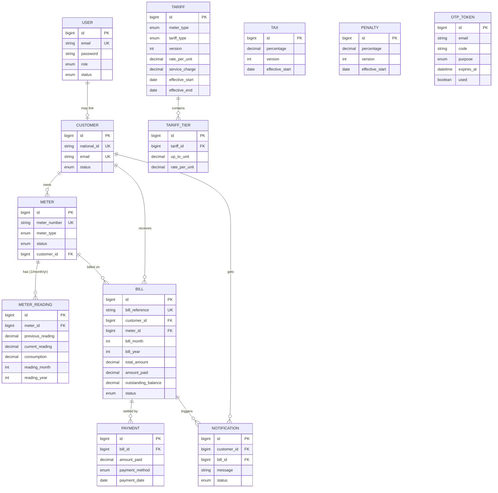

# Entity Relationship Diagram — Utility Billing System

Two formats below: a plain-text (crow's-foot) diagram that renders anywhere, and a
Mermaid version. To see the Mermaid one as a picture, either install the **Mermaid**
plugin in IntelliJ (Settings → Plugins → "Mermaid"), or paste the block into
<https://mermaid.live>.

---

## A. Crow's-foot ERD (plain text — always readable)

```
                          ┌─────────────────────────┐
                          │          USER           │
                          ├─────────────────────────┤
                          │ PK  id                  │
                          │ UQ  email (username)    │
                          │     full_names          │
                          │     phone_number        │
                          │     password (bcrypt)   │
                          │     role  (enum)        │
                          │     status(enum)        │
                          │ FK  customer_id (0..1) ─┼───┐ (optional link for
                          └─────────────────────────┘   │  ROLE_CUSTOMER logins)
                                                         │
        ┌────────────────────────────┐                  │
        │          CUSTOMER           │◄─────────────────┘
        ├────────────────────────────┤
        │ PK  id                     │
        │ UQ  national_id            │
        │ UQ  email                  │
        │     full_names             │
        │     phone_number, address  │
        │     status (ACTIVE/INACTIVE)│
        └──────────┬─────────────────┘
                   │1                                   1│
        owns       │                          receives   │
                   │ N                                   │ N
        ┌──────────▼───────────┐               ┌─────────▼──────────────────────┐
        │        METER         │               │             BILL               │
        ├──────────────────────┤               ├────────────────────────────────┤
        │ PK  id               │               │ PK  id                         │
        │ UQ  meter_number     │               │ UQ  bill_reference             │
        │     meter_type(enum) │               │ FK  customer_id                │
        │     installation_date│               │ FK  meter_id                   │
        │     status(enum)     │      billed_on │     bill_month, bill_year      │
        │ FK  customer_id      │◄──────────────┤│     (UQ: meter+month+year)     │
        └──────────┬───────────┘   1        N  │     consumption                │
                   │1                          │     tariff_amount               │
        has        │                           │     service_charge, tax_amount  │
                   │ N    (UQ: meter+month+year)│     penalty_amount, total_amount│
        ┌──────────▼─────────────────┐         │     amount_paid                 │
        │       METER_READING         │         │     outstanding_balance        │
        ├─────────────────────────────┤         │     due_date                   │
        │ PK  id                      │         │     status (enum, 5 states)    │
        │ FK  meter_id                │         └────────┬───────────────┬───────┘
        │     previous_reading        │                 1│              1│
        │     current_reading         │     settled_by   │     triggers  │
        │     consumption             │                 N│              N│
        │     reading_date            │       ┌──────────▼─────┐ ┌──────▼──────────────┐
        │     reading_month,reading_yr│       │    PAYMENT     │ │   NOTIFICATION      │
        │     billed                  │       ├────────────────┤ ├─────────────────────┤
        └─────────────────────────────┘       │ PK id          │ │ PK id               │
                                              │ FK bill_id     │ │ FK customer_id      │
                                              │   amount_paid  │ │ FK bill_id (0..1)   │
                                              │   payment_method│ │   message           │
        ┌──────────────────────┐              │   payment_date │ │   status (enum)     │
        │       TARIFF         │              │   txn_reference│ │   created_at        │
        ├──────────────────────┤              └────────────────┘ └─────────────────────┘
        │ PK  id               │1
        │     meter_type       │
        │     tariff_type      │  contains      ┌─────────────────────┐
        │     version          │───────────────►│    TARIFF_TIER      │
        │     rate_per_unit    │  N             ├─────────────────────┤
        │     service_charge   │                │ PK id               │
        │     effective_start  │                │ FK tariff_id        │
        │     effective_end    │                │   up_to_unit (null= top tier) │
        └──────────────────────┘                │   rate_per_unit     │
                                                └─────────────────────┘
        ┌──────────────────────┐   ┌──────────────────────┐   ┌──────────────────────┐
        │         TAX          │   │       PENALTY        │   │      OTP_TOKEN       │
        ├──────────────────────┤   ├──────────────────────┤   ├──────────────────────┤
        │ PK id                │   │ PK id                │   │ PK id                │
        │   name, percentage   │   │   name, percentage   │   │   email              │
        │   version            │   │   version            │   │   code               │
        │   effective_start    │   │   effective_start    │   │   purpose (enum)     │
        │   effective_end      │   │   effective_end      │   │   expires_at, used   │
        └──────────────────────┘   └──────────────────────┘   └──────────────────────┘
   (versioned configs — selected by billing-cycle date; not FK-linked to bills,
    the effective version is resolved at bill-generation time)
```

**Cardinalities (read "one-to-many" as 1──N):**
- USER 0..1 ── 1 CUSTOMER (a customer login optionally points to a customer record)
- CUSTOMER 1 ── N METER
- CUSTOMER 1 ── N BILL
- CUSTOMER 1 ── N NOTIFICATION
- METER 1 ── N METER_READING (unique per meter + month + year)
- METER 1 ── N BILL (unique per meter + month + year)
- TARIFF 1 ── N TARIFF_TIER
- BILL 1 ── N PAYMENT
- BILL 1 ── N NOTIFICATION
- TAX / PENALTY / TARIFF are **versioned**; the row whose `[effective_start, effective_end]`
  window covers the billing-cycle date is chosen during bill generation.

---

## B. Mermaid ERD (renders to a picture at mermaid.live or with the Mermaid plugin)


